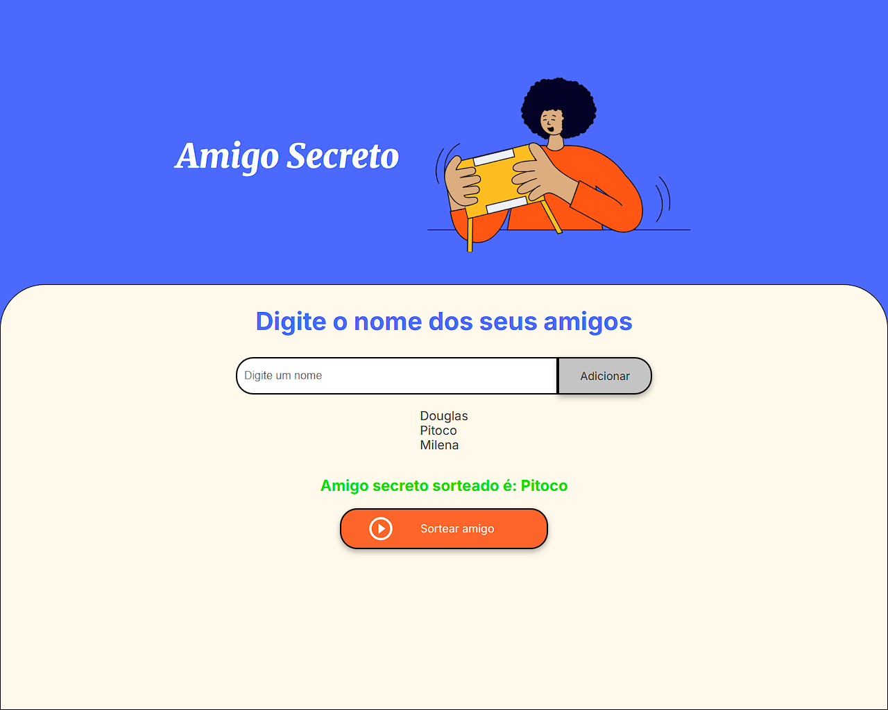

# Challenge-Oracle-AmigoSecreto

Este é um projeto de Amigo Secreto desenvolvido como parte de um desafio para fortalecer habilidades em lógica de programação.

## Descrição

O objetivo deste projeto é permitir que os usuários adicionem nomes de amigos e realizem um sorteio de Amigo Secreto. O sorteio garante que cada amigo seja atribuído a outro amigo de forma aleatória.

## Funcionalidades

- Adicionar nomes de amigos
- Listar os amigos adicionados
- Realizar o sorteio de Amigo Secreto
- Exibir o resultado do sorteio

## Estrutura do Projeto

- `index.html`: Estrutura HTML da aplicação.
- `style.css`: Estilos CSS para a aplicação.
- `app.js`: Lógica de programação para adicionar amigos e realizar o sorteio.
- `assets/`: Contém imagens utilizadas na aplicação.

## Como Usar

- Deploy: https://challenge-oracle-amigo-secreto-8uk1kvoia.vercel.app/

OU

1. Abra o arquivo `index.html` em um navegador web.
2. Digite o nome de um amigo no campo de entrada e clique no botão "Adicionar".
3. Repita o processo para adicionar pelo menos dois amigos.
4. Clique no botão "Sortear amigo" para realizar o sorteio.
5. O resultado do sorteio será exibido na tela.

## Tecnologias Utilizadas

- HTML
- CSS
- JavaScript

## Capturas de Tela

## Autor

Desenvolvido por Douglas Caíque.

## Licença

Este projeto está licenciado sob a Licença MIT - veja o arquivo [LICENSE](LICENSE) para mais detalhes.

